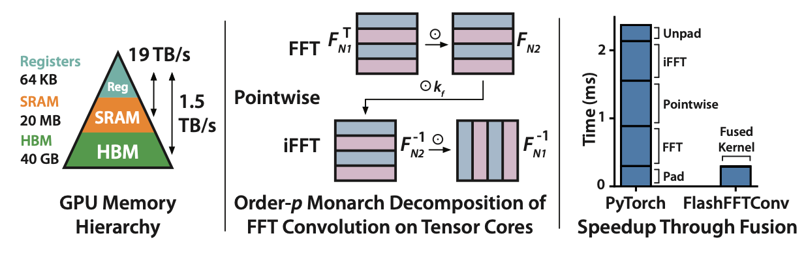

# FlashFFTConv: Efficient Convolutions for Long Sequences with Tensor Cores

This repository contains the official code for FlashFFTConv, a fast algorithm for computing long depthwise convolutions using the FFT algorithm.

FlashFFTConv computes convolutions up to 7.93 times faster than PyTorch FFT convolutions, with up to 8.21 times less memory usage.
FlashFFTConv supports convolution kernel lengths up to 4,194,304.

We also provide a fast kernel for short 1D depthwise convolutions (e.g., where the kernel length is on the order of 3/5), which runs 7 times faster than PyTorch Conv1D.
This module is useful for additional speedup for language models like Monarch Mixer, H3, and Hyena.

**FlashFFTConv: Efficient Convolutions for Long Sequences with Tensor Cores**  
Daniel Y. Fu\*, Hermann Kumbong\*, Eric Nguyen, Christopher Ré\
Paper: https://arxiv.org/abs/2311.05908 \
Blog: https://hazyresearch.stanford.edu/blog/2023-11-13-flashfftconv




## Examples and Usage

We've been happy to use FlashFFTConv to support various projects, including [Monarch Mixer](https://github.com/HazyResearch/m2), [Hyena/H3](https://github.com/HazyResearch/safari), [HyenaDNA](https://github.com/HazyResearch/hyena-dna), and more.
FlashFFTConv is also being used to train various new models that haven't been released yet - we'll be updating this README with pointers as they're publicly announced.

Check out the [examples](examples) folder for end-to-end examples of how to use FlashFFTConv in your models.

You can also run a standalone CIFAR example to see usage as soon as the package is installed:
```
python standalone_cifar.py
```

## Installation

**Requirements:** We recommend using the Nvidia PyTorch docker container. We've tested and developed this library on version [23.05](https://catalog.ngc.nvidia.com/orgs/nvidia/containers/pytorch).
* PyTorch 2.0 Required
* We have tested with CUDA version 12.1 and toolkit version 12.1
* We have tested this on A100 and H100, but it should work on any Ampere/Hopper architecture (3090, 4090, etc)

To check your CUDA version:
* Run `nvcc --version` and check the version number of your CUDA toolkit. Our Docker ships with version 12.1.
* Run `nvidia-smi` to check the version of your CUDA drivers. Our Docker ships with version 12.1.

```bash
git clone https://github.com/HazyResearch/flash-fft-conv.git

cd flash-fft-conv

cd csrc/flashfftconv
python setup.py install

cd ../../..

python setup.py install
```

Once it's installed, you should be able to run the test suite:
```
pytest -s -q tests/test_flashfftconv.py
```

This test should run on machines with 40GB of GPU memory.

### Short Depthwise Kernel

The short depthwise kernel is also installed with these commands. You can run this like this:
```
pytest -s -q tests/test_conv1d.py
```

## How to Use FlashFFTConv

The `flashfftconv` package contains a PyTorch interface called `FlashFFTConv`, which is initialized with a particular FFT size.

This module computes an FFT convolution (`iFFT(FFT(u) * FFT(k))`).
```Python
from flashfftconv import FlashFFTConv
```

Usage:
```Python
from flashfftconv import FlashFFTConv

# size of the FFT
my_flashfftconv = FlashFFTConv(32768, dtype=torch.bfloat16) # generally more stable!

# B is batch size, H is model dimension, L is sequence length
B = 16
H = 768
# input can be smaller than FFT size, but needs to be divisible by 2
L = 16384

# the input, B H L
x = torch.randn(B, H, L, dtype=torch.bfloat16) # same type as the input
k = torch.randn(H, L, dtype=torch.float32) # kernel needs to be fp32 for now

out = my_flashfftconv(x, k)
```

### Example Model

**We recommend creating one FlashFFTConv object per model, and reusing it between layers.**

For example:
```Python
import torch
from flashfftconv import FlashFFTConv

def MyModel(torch.nn.Module):
    def __init__(self, H, seqlen, num_layers):
        super().__init__()

        self.H = H
        self.seqlen = seqlen
        self.num_layers = num_layers
        self.flashfftconv = FlashFFTConv(seqlen, dtype=torch.bfloat16)

        # create your conv layers
        self.long_conv_layers = torch.nn.ModuleList([
            ConvLayer(H, seqlen)
            for i in range(num_layers)
        ])

        # add a pointer to the flashfft object in each layer
        for layer in self.long_conv_layers:
            layer.flashfftconv = self.flashfftconv

        ...
    
    def forward(self, x):
        for layer in self.long_conv_layers:
            x = layer(x)

        return x

def ConvLayer(torch.nn.Module):
    def __init__(self, H, seqlen):
        self.k = torch.nn.Parameter(torch.randn(H, seqlen, dtype=torch.float32))
        ...

    def forward(self, x):
        return self.flashfftconv(x, self.k) # self.flashfftconv comes from the wrapper model!
```

### Gating and Implicit Padding
A common use case for long FFT convolutions is for language modeling.
These architectures often use **gated** convolutions and **pad** the inputs with zeros to ensure causality.

For example, a gated causal convolution might look like this in PyTorch:
```Python
def gated_conv(u, k, in_gate, out_gate):
    # u, in_gate, and out_gate have shape B, H, L
    # k has shape H, L
    B, H, L = u.shape
    fft_size = 2 * L
    padding = fft_size - L
    u = torch.nn.functional.pad(u, (0, padding))
    k = torch.nn.functional.pad(k, (0, padding))
    in_gate = torch.nn.functional.pad(in_gate, (0, padding))
    out_gate = torch.nn.functional.pad(out_gate, (0, padding))

    # compute the gated convolution
    u_f = torch.fft.fft(u * in_gate, dim=-1)
    k_f = torch.fft.fft(k, dim=-1)
    y_f = u_f * k_f
    y = torch.fft.ifft(y_f, dim=-1).real * out_gate
    return y
```
Each of these padding operations, as well as the gating operations, incur expensive memory I/Os, which slows down the model.

FlashFFTConv supports implicit padding and gating without the need for extra I/O:
```Python
L = ... # get L from somewhere
flashfftconv = FlashFFTConv(2 * L, dtype=torch.bfloat16) # bf16 is usually necessary for gating
y = flashfftconv(u, k, in_gate, out_gate)
```

### Short Depthwise Convolutions

For short, depthwise convolutions (`groups = dimension` in PyTorch Conv1D), you can run them like this:
```Python
from flashfftconv import FlashDepthwiseConv1d

# set up PyTorch equivalent to get the weights
# in_channels = out_channels, and kernel size must be odd
conv1d_torch = nn.Conv1d(
    in_channels = d,
    out_channels = d,
    kernel_size = k,
    groups = d,
    padding = padding,
    dtype = dtype
)

flash_conv1d = FlashDepthWiseConv1d(
    channels = d,
    kernel_size=k,
    padding=padding,
    weights=conv1d_torch.weight,
    bias=conv1d_torch.bias,
    dtype = dtype # this should be the dtype of the weights
)

out_torch = conv1d_torch(x) # x is B, d, L
out_flash = flash_conv1d(x) # x can be a different dtype than weights

# out_torch and out_flash should be the same!
```

To support mixed precision training, `FlashDepthWiseConv1d` supports using fp32 weights with fp16 inputs (or fp32 inputs).
Currently the bf16 backward pass has a bug, but the forward pass is supported.

## Benchmarking

### FlashFFTConv Benchmarks
To run FlashFFTConv benchmarks, install the module and run `python benchmarks/benchmark_flashfftconv.py`.

These are the runtimes we see for a gated convolution for various sequence lengths, on one H100-SXM.
All results scaled to batch size 64, hidden dimension 768.

| Sequence Length | **256** | **1K** | **4K** | **8K** | **16K** | **32K** | **1M** | **2M** | **4M** |
| --- | --- | --- | --- | --- | --- | --- | --- | --- | --- |
| PyTorch | 0.62 | 2.30 | 9.49 | 19.4 | 29.9 | 84.8 | 3,071.4 | 6,342.6 | 13,031.2 |
| FlashFFTConv | **0.11** | **0.29** | **1.43** | **3.58** | **12.2** | **26.3** | **1,768.9** | **4,623.5** | **10,049.4** |
| Speedup | 5.64× | 7.93× | 6.64× | 5.42× | 2.45× | 3.22× | 1.74× | 1.37× | 1.30× |
| Memory Savings | 6.65× | 6.40× | 6.35× | 6.34× | 6.17× | 5.87× | 2.82× | 2.81× | 2.81× |

Please see our paper for more benchmarks!

### Short Depthwise Convolution Benchmarks
To benchmark short depthwise convolutions, install the module and run `python benchmarks/benchmark_conv1d.py`.

Here are some results for BLH input on H100:


| B  |  L   |  D   | K | torch time (ms) | cudatime (ms) | speedup |
| --- | --- | --- | --- | --- | --- | --- | 
| 16 | 1024 | 768  | 5 |       0.19      |      0.03     |   5.50  |
| 16 | 1024 | 1024 | 5 |       0.25      |      0.04     |   6.00  |
| 16 | 1024 | 2048 | 5 |       0.50      |      0.08     |   6.50  |
| 16 | 1024 | 8192 | 5 |       2.08      |      0.29     |   7.21  |
| 16 | 2048 | 768  | 5 |       0.37      |      0.06     |   5.91  |
| 16 | 2048 | 1024 | 5 |       0.50      |      0.08     |   6.33  |
| 16 | 2048 | 2048 | 5 |       1.00      |      0.15     |   6.77  |
| 16 | 2048 | 8192 | 5 |       4.17      |      0.57     |   7.31  |
| 16 | 4096 | 768  | 5 |       0.74      |      0.12     |   6.17  |
| 16 | 4096 | 1024 | 5 |       0.99      |      0.15     |   6.56  |
| 16 | 4096 | 2048 | 5 |       2.03      |      0.29     |   7.04  |
| 16 | 4096 | 8192 | 5 |       8.25      |      1.14     |   7.27  |
| 16 | 8192 | 768  | 5 |       1.49      |      0.23     |   6.36  |
| 16 | 8192 | 1024 | 5 |       2.01      |      0.30     |   6.80  |
| 16 | 8192 | 2048 | 5 |       4.10      |      0.57     |   7.18  |
| 16 | 8192 | 8192 | 5 |      16.42      |      2.26     |   7.26  |


We also support BHL input, but it's a bit slower (still optimizing!).

## Input Requirements and Notes
Currently, we have a few requirements on the inputs to the interface to FlashFFTConv:
* We assume that the input `u` has shape `(B, H, L)`, and the kernel `k` has shape `(H, L)`.
* These inputs must be contiguous in GPU memory (`u.is_contiguous()` should be True).
* The FFT size (`seqlen` that `FlashFFTConv` is initialized with) must be a power of two between 256 and 4,194,304.
* For FFT sizes larger than 32,768, `H` must be a multiple of 16.
* `L` can be smaller than FFT size but must be divisible by 2. For FFT sizes `512` and `2048`, `L` must be divisible by 4.
* We only support FP16 and BF16 for now. FP16 is faster, but we generally find BF16 more stable during training.
* For short depthwise convs, we only support FP16 for now, and the kernel size has to be odd.

## Citation

This work builds on a line of work studying how to make FFT convolutions efficient on GPUs:
* [Monarch Mixer: A Simple Sub-Quadratic GEMM-Based Architecture](https://arxiv.org/abs/2310.12109)
* [Simple Hardware-Efficient Long Convolutions for Sequence Modeling](https://arxiv.org/abs/2302.06646)
* [Hungry Hungry Hippos: Towards Language Modeling with State Space Models](https://arxiv.org/abs/2212.14052)

If you use this codebase or otherwise found the ideas useful, please reach out to let us know - we love hearing about how our work is being used!
You can reach Dan at [danfu@cs.stanford.edu](mailto:danfu@cs.stanford.edu).

You can also cite our work:
```
@article{fu2023flashfftconv,
  title={Flash{FFTC}onv: Efficient Convolutions for Long Sequences with Tensor Cores},
  author={Fu, Daniel Y. and Kumbong, Hermann and Nguyen, Eric and R{\'e}, Christopher},
  booktitle={arXiv preprint arXiv:2311.05908},
  year={2023}
}

@inproceedings{fu2023monarch,
  title={Monarch {M}ixer: A Simple Sub-Quadratic GEMM-Based Architecture},
  author={Fu, Daniel Y. and Arora, Simran and Grogan, Jessica and Johnson, Isys and Eyuboglu, Sabri and Thomas, Armin W and Spector, Benjamin and Poli, Michael and Rudra, Atri and R{\'e}, Christopher},
  booktitle={Advances in Neural Information Processing Systems},
  year={2023}
}

@inproceedings{fu2023simple,
  title={Simple Hardware-Efficient Long Convolutions for Sequence Modeling},
  author={Fu, Daniel Y. and Epstein, Elliot L. and Nguyen, Eric and Thomas, Armin W. and Zhang, Michael and Dao, Tri and Rudra, Atri and R{\'e}, Christopher},
  journal={International Conference on Machine Learning},
  year={2023}
}

@inproceedings{fu2023hungry,
  title={Hungry {H}ungry {H}ippos: Towards Language Modeling with State Space Models},
  author={Fu, Daniel Y. and Dao, Tri and Saab, Khaled K. and Thomas, Armin W.
  and Rudra, Atri and R{\'e}, Christopher},
  booktitle={International Conference on Learning Representations},
  year={2023}
}
```
